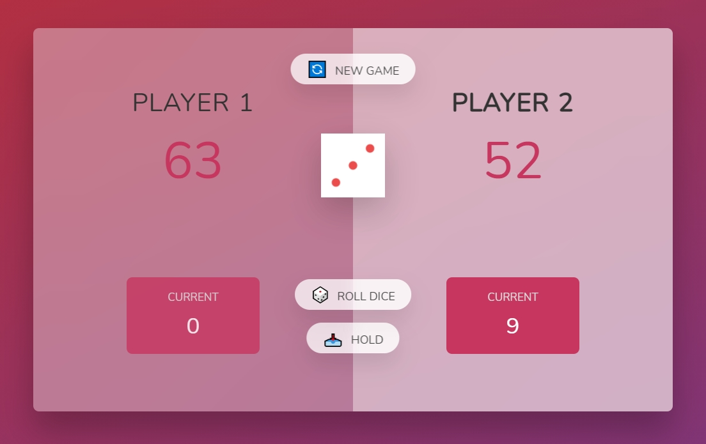

# Pig Game :game_die:

Pig Game is a dice game.

◈ Rules of the game: It is played with 2 players. On each turn, a player rolls a die as many times as he wishes. Each result is added to their CURRENT score, but if the player rolls a 1, then all of their CURRENT score is lost and then it is the next player's turn. The player can choose to stand, which means his CURRENT score is added to his OVERALL score and then the next player's turn is passed. The first player to reach 100 points in the GLOBAL score wins the game!
## Demo

[**Project**](https://pig-game-es6.netlify.app/) created in a Udemy course of [JavaScript ES6+](https://www.udemy.com/course/the-complete-javascript-course/)

## Screenshot

## Flowchart

## Author

- [Jonas Schmedtmann](https://www.udemy.com/user/jonasschmedtmann/)
